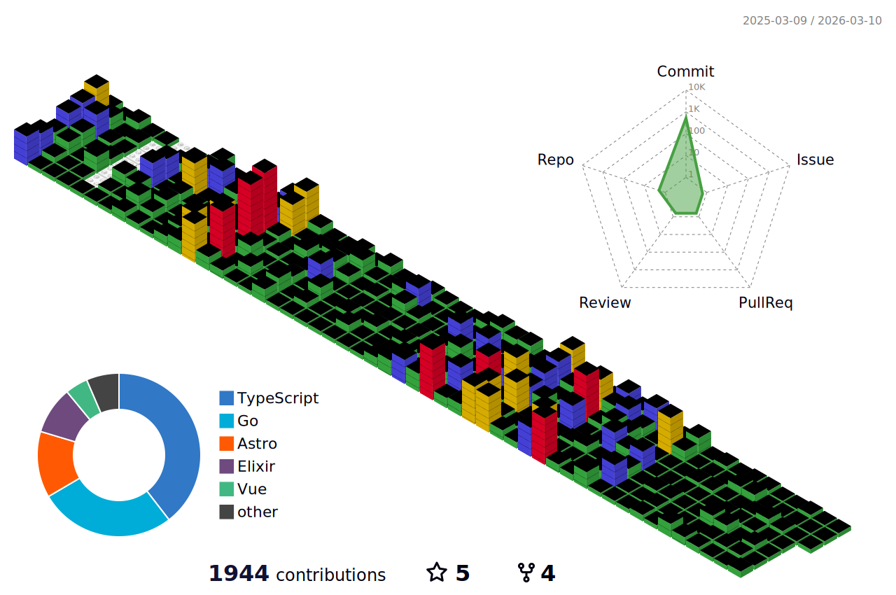

# Hello  👋

<!-- 
 -->

<!--
**Stroustrups-Sentinel/Stroustrups-Sentinel** is a ✨ _special_ ✨ repository because its `README.md` (this file) appears on your GitHub profile.

Here are some ideas to get you started:

- 🔭 I’m currently working on ...
- 🌱 I’m currently learning ...
- 👯 I’m looking to collaborate on ...
- 🤔 I’m looking for help with ...
- 💬 Ask me about ...
- 📫 How to reach me: ...
- 😄 Pronouns: ...
- ⚡ Fun fact: ...
-->

I'm a full-stack web developer with skills in front-end 🎨, back-end 🖥️, and mobile development 📱(Flutter). Passionate about using technology to build products that solve real-life problems.

🎓 **Fresh out of college** with a drive to create ✨high-quality, production-grade software.

🚀 **Skilled in full-stack web development**, mobile development, and UI/UX design.

📚 **Actively learning software architecture 🏗️, systems engineering ⚙️, performance in computing ⚡️, programming language principles 📝, project management 🗂️, IoT 📡, and data science 📊** to make my software scalable and efficient.

💡 Adventurous and optimistic about the future of technology.

🤝 **Looking for opportunities to contribute to open source projects**, work on exciting new technologies, and learn from other talented engineers 👩‍💻👨‍💻.

Let's create wonderful adventures in this 'eventful' world of computers! 💻

  
<!--  -->
<!--  -->

 

## `Programming Languages 🤖`

> **ℹ️ based on public repositories**

## `Fellow visits 👀`

## `Repo Activity 📊`

